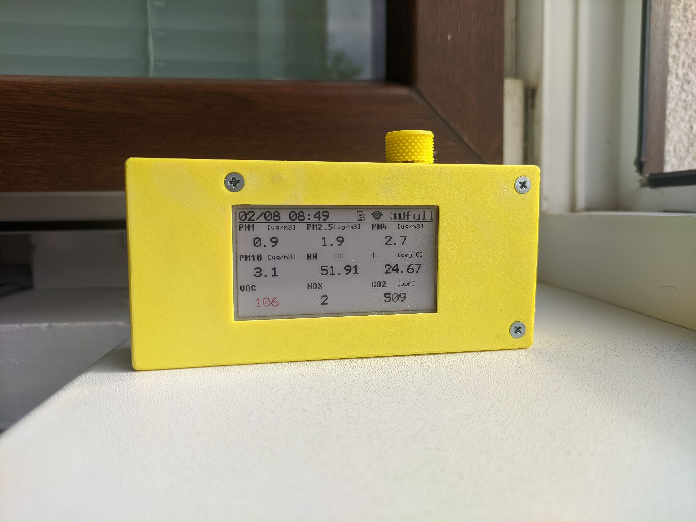
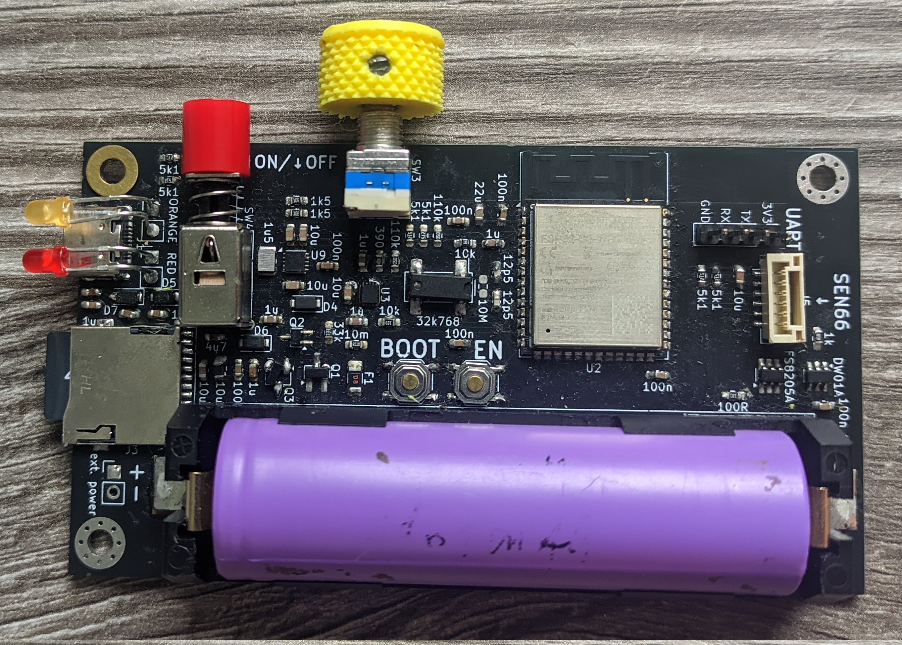
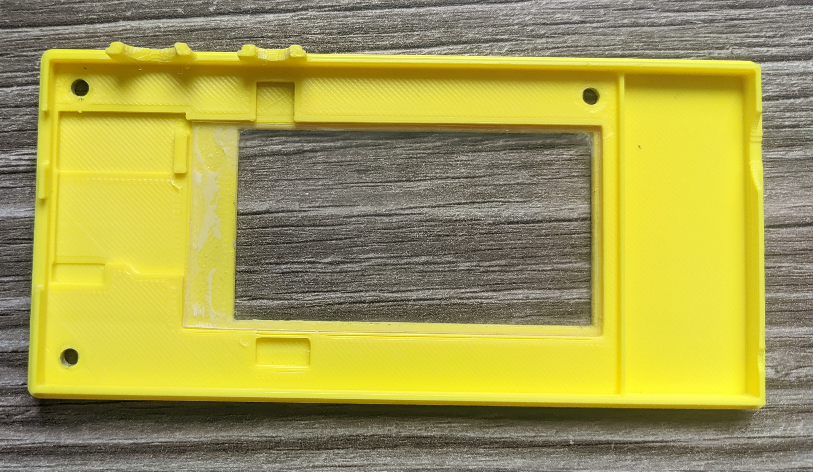
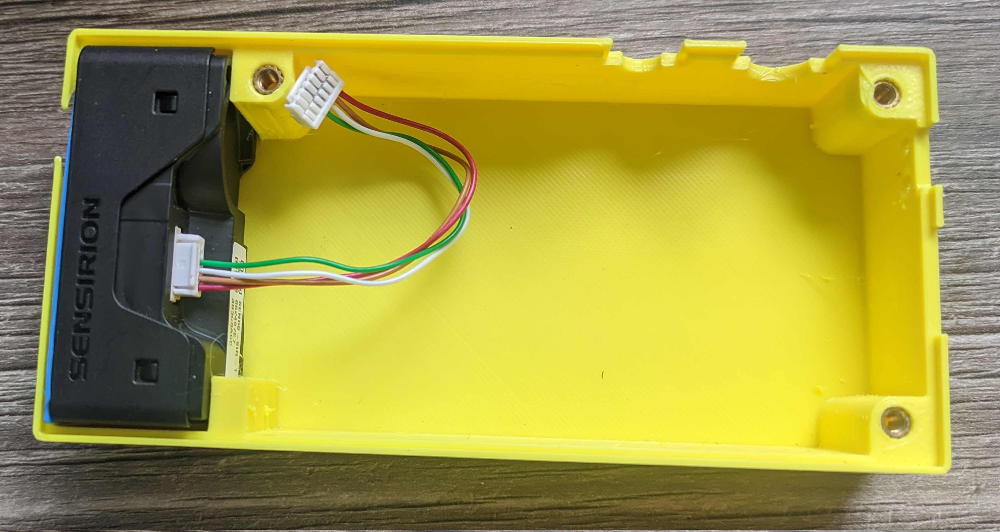
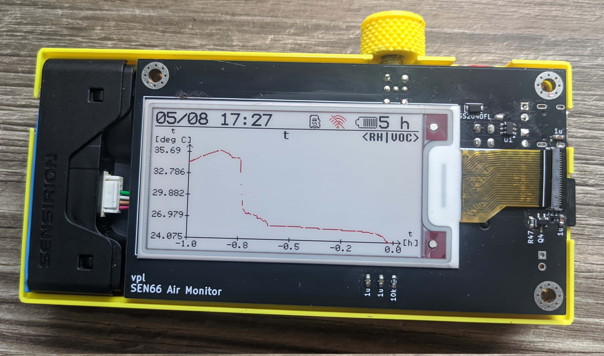

<h1 align="center">
    
</h1>

# SEN66 Air Quality Monitor With EPD Output

The goal of this project is to create portable air quality monitor, which can be
used to measure the air quality in all environments I am in throughout the day,
especially where I sleep.

## Readme if you Consider Making This

I would like make a new hardware and accompanying software revision, as I have
found some design quirks I have made:

- I have accidentally bought BWR EPD instead of the newer BWRY, forcing me to
  not be able to use the yellow color.
- The power button is sunken too much (by about 1 mm).
- The rotary encoder is not a good user interface, as the EPD has a refresh time
  of about 15 seconds (though the BWRY version may improve this); dedicated
  buttons would be better.
- The cable to the SEN66 sensor is quite finicky to make without the proper
  tools.
- Looking at the SEN66 sensor itself, it is of a very nice form factor, though
  not that good price-wise.

## To-Do:

- Add photos, features, and description.
- Beautify the code.
- Check the accuracy displayed.
- Record and add some data on Git.
- Clear display of current values with _badness level_.
- Show trend in overview.
- Consider adding AP functionality.
- Consider using bat_low alarm.
- Consider adding red background to really bad values.
- Add average overview.
- Optimize the power consumption.

### To-Do for Next Revision(s)

- Consider adding soft power button.
- Consider adding a _busy_ LED if the BWRY EPD still has slow update time.
- Create a version without battery.

## Build Instructions

### Required parts:

- 1x M3x(3-5) mm grub screw
- 3x M3x(15-25) mm screw with countersunk head
- 3x M3 thread inserts suitable for a 4 mm hole
- micro SD card for data storage and graphing function
- 0.5 mm plastic sheet cut to 37 mm x 73 mm as a protection for the EPD (though
  with a little modification to the case files can be disregarded)
- populated PCB with a cap for the power switch
- printed case, encoder knob and a gasket for SEN66 (recommended to be made with
  a flexible plastic; not required)
- SEN66 - PCB connection wire
- 18650 battery, if non-powered usage is desired

### Some Photos Which Should Help

<h3 align="center">
    
</h3>
<h3 align="center">
    
</h3>
<h3 align="center">
    
</h3>
<h3 align="center">
    
</h3>

## Air Quality Thresholds Table

|                                | PM2.5, PM1, PM4 | PM10       | humidex  | voc, nox index | CO2          |
| ------------------------------ | --------------- | ---------- | -------- | -------------- | ------------ |
| good                           | [0; 9]          | [0; 55]    | [0; 28]  | [0; 50]        | [400; 800]   |
| moderate                       | (9; 35.5]       | (55; 155]  | (28; 32] | (50; 100]      | (800; 1000]  |
| unhealthy for sensitive groups | (35.5; 55.5]    | (155; 255] | (32; 36] | (100; 200]     | (1000; 1500] |
| unhealthy                      | (55.5; 125.5]   | (255; 355] | (36; 42] | (200; 300]     | (1500; 2000] |
| very unhealhty                 | (125.5; 225.5]  | (355; 425] | (42; 45] | (300; 400]     | (2000; 5000] |
| hazardous                      | (225.5; ∞]      | (425; ∞]   | (45; ∞)  | (400; ∞)       | (5000; ∞)    |

Based on:

- [Agency for Toxic Substances and Disease Registry (ATSDR). 2024. Guidance for Inhalation Exposures to Particulate Matter. U.S. Department of Health and Human Services, Public Health Service, Atlanta, GA. June 2024 update, Appendix B](https://www.atsdr.cdc.gov/pha-guidance/resources/ATSDR-Particulate-Matter-Guidance-508.pdf)
  for PM2.5 (and from it PM1 and PM4 as there do not seem to be any specific
  resources for these) and PM10
- [XIRIS. "Environmental and Indoor Measuring." XIRIS, https://www.xiris.si/en/projects/environmental-and-indoor-measuring/. Accessed 1 Aug. 2025](https://www.xiris.si/en/projects/environmental-and-indoor-measuring/)
  for CO2 with lowered good and moderate levels
- [Environment and Climate Change Canada. (n.d.). Warm season weather hazards. Government of Canada. Retrieved August 1, 2025, from https://www.canada.ca/en/environment-climate-change/services/seasonal-weather-hazards/warm-season-weather-hazards.html#toc7](https://www.canada.ca/en/environment-climate-change/services/seasonal-weather-hazards/warm-season-weather-hazards.html#toc7)
  for humidex
- The VOC and NOX indices are not based on anything as I have not found any good
  interpretation help in SEN66's docs. From my measurements the NOX usually
  hovers in the range [0; 2] and VOC jumps semi randomly. I would like to
  investigate these values more in the future.

## Attributions

- The SD card, Wi-Fi and battery icons are made by Gaai available at
  [lopaka](https://github.com/sbrin/lopaka).
- The font used for the charging status markings on the case is Atkinson
  Hyperlegible, available at
  [Braille Institute's website](https://www.brailleinstitute.org/freefont/)
- The SD card abstraction functions are based on
  [this example.](https://github.com/espressif/arduino-esp32/blob/master/libraries/SD_MMC/examples/SDMMC_Test/SDMMC_Test.ino).
