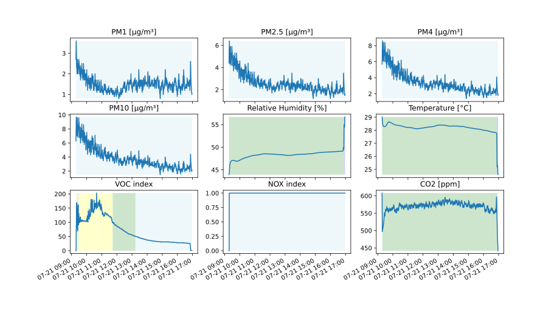

# Sample Data

The sample room has dimensions of about 2.4x5.9x2.7 meters (not including
furniture for simplicity) and there is a window of 145x95 centimeters, which can
be closed/in the ventilation position/fully opened.

#### Room with one person for a few hours, window fully opened before and after.

#### Room empty for half a day, some ventilation before and after.

#### Room empty for two days, window fully opened before and after (~30 minutes).

#### Room with one person overnight, window left at ventilation position and window fully opened before and after.

